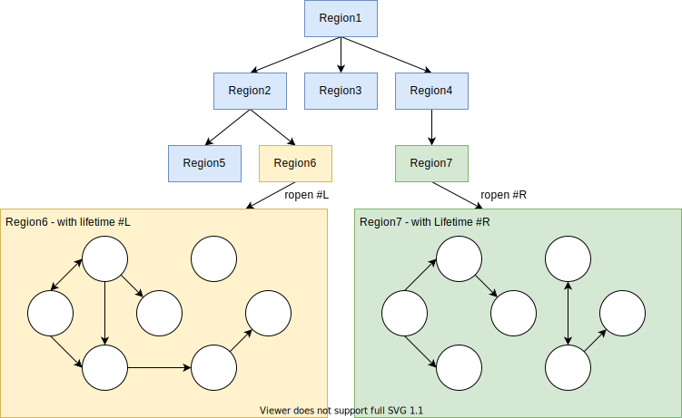

# Stark Language Reference

> Notice: 
> 
> This document serves currently as a design overview of the language, but should not be considered as a full
> language reference.
> Links to grammar are missing and the document is still missing lots of details.
>
> It's a work in progress!

- [Modules](#modules)
  - [Module declaration](#module-declaration)
  - [Import statement](#import-statement)
- [Concepts](#concepts)
  - [Smart references](#smart-references)
    - [Lifetime](#lifetime)
    - [Permission](#permission)
  - [Capabilities](#capabilities)
  - [Asynchronous programming](#asynchronous-programming)
- [Types](#types)
  - [Primitive types](#primitive-types)
  - [Enum types](#enum-types)
  - [Union types](#union-types)
  - [Struct types](#struct-types)
    - [Struct with a fixed constructor](#struct-with-a-fixed-constructor)
    - [Struct with explicit field declaration](#struct-with-explicit-field-declaration)
    - [Linear Struct](#linear-struct)
    - [Region Struct](#region-struct)
    - [Ref Struct](#ref-struct)
    - [Multiple constructors](#multiple-constructors)
    - [Struct of Array - SOA](#struct-of-array---soa)
  - [Interface types](#interface-types)
    - [Async interface](#async-interface)
  - [Definition modulator](#definition-modulator)
  - [Optional types](#optional-types)
  - [Tuple types](#tuple-types)
  - [Unit types](#unit-types)
  - [Indirect types](#indirect-types)
  - [Alias types](#alias-types)
  - [Type extensions](#type-extensions)
  - [Reference types](#reference-types)
  - [Pointer types](#pointer-types)
  - [Function types](#function-types)
- [Generic parameterization](#generic-parameterization)
  - [Generics: an example](#generics-an-example)
  - [Generic forms](#generic-forms)
  - [Generic parameters](#generic-parameters)
  - [Generic parameter constraints](#generic-parameter-constraints)
- [Functions](#functions)
  - [Static functions](#static-functions)
  - [This functions](#this-functions)
  - [Property functions](#property-functions)
  - [Indexer functions](#indexer-functions)
  - [Operator functions](#operator-functions)
  - [Function contracts](#function-contracts)
- [Global values](#global-values)
  - [Const declaration](#const-declaration)
  - [Static declaration](#static-declaration)
- [Statements](#statements)
- [Expressions](#expressions)
- [Exceptions](#exceptions)
- [Attributes](#attributes)
- [Macros](#macros)
- [Packages](#packages)
- [Libraries](#libraries)
- [Naming conventions](#naming-conventions)
- [Lexical](#lexical)
  - [List of keywords](#list-of-keywords)
  - [List of reserved keywords](#list-of-reserved-keywords)
  - [`identifier` (lexer)](#identifier-lexer)

[:top:](#stark-language-reference)

## Modules

A `module` allows to group together types and functions. It can be private (the default) or public.
You can have multiple modules in a [library](#libraries)
### Module declaration

> **Rule-1001**: The name of a module is composed of a list of `snake_case` [identifiers](#identifier-lexer) separated by `::`.

A module name is separated by `::`. For example the module `core::io::console` declares:
- a module `core`
- the sub-module `io` of `core`
- the sub-module `console` of `core::io`.

```stark
module core::io::console
```

> **Rule-1002**: You can declare **only one module in a file** and it must come first **at the beginning of the file** before any other declarations or imports.

> **Rule-1003**: By default, a module can only be declared from one file, if you use it from different file, you need to prefix it with `partial`

```stark
// File: types.sk
partial module core::io::console
...
// File: funcs.sk
partial module core::io::console
...
```

> **Rule-1004**: By default, a module is private. You need to declare it public to be visible from outside a library

```stark
// The module will be visible outside of the library
pub module core::io::console
```

> **Rule-1005**: All private modules and types are visible/accessible from a same library.

It is recommended to organize the code on the filesystem like this:
- If a module doesn't have nested modules
  - It can be stored in a single file and in that case the file should be the name of the module. (e.g `console.sk` above)
  - It can be stored in a folder if the module requires multiple files and in that case the directory should be the name of the module. (e.g `console/` above)

> **Rule-1006**: A file declared without a module lands into the top level anonymous module. 

Usually, the top-level anonymous module is used by executables with a main entrypoint function.

It is not recommended to use an anonymous module within a library.

> **Rule-1007**: A module is closed from a library. It cannot be extended outside of this library except that sub-modules can be created. An alias that doesn't collide needs to be created in the build configuration file.

TBD link to how to declare this in a configuration file.

> **Rule-1008**: Multiple modules declared in a library must share the same root name.

For example, `core::io` and `core::collections` share the same `core` root name.

[:top:](#stark-language-reference)

### Import statement

The `import` statement allows to import declarations from another module into the current scope.

> **Rule-1101**: All declarations from parent modules are accessible to the current module.

For declarations that are in a different module path that doesn't share the same module path, you need to import the module.

```stark
partial module core::io
// has access to all declarations from `core::io` and from `core`

// Imports all declarations from the sub-module core::io::internal
import core::io::internal::*
```

> **Rule-1102**: The import statement provides 3 kinds of import. 
> 1. Wildcard: `*` that will import all declarations from a module.
>    ```stark
>    import core::io::internal::*
>    ```
> 2. Single: Will import a single declarations from a module.
>    ```stark
>    import core::io::internal::MyInternalType
>    ```
> 3. Grouped: Will import a list of declarations from a module.
>    ```stark
>    import core::io::internal::{ MyInternalType, my_function2 }
>    ```

The import statement can also be used by interface, struct and extension declarations within their extra-declarations. (TBD: add a link to extra-declaration).

[:top:](#stark-language-reference)

## Concepts

Before diving into the other parts of this document we need to explain a few core concepts:
- [Smart references](#smart-references)
- [Capabilities](#capabilities)
- [Asynchronous programming](#asynchronous-programming)

### Smart references

When a reference is made to a value in memory, it is composed of a type of the value referenced and 2 kind of qualifiers:

- A [lifetime](#lifetime).
- A [permission](#permission).

```stark
// A reference to a read-writeable MyObject with the #local lifetime
let obj: &#local`rw MyObject
```
#### Lifetime

Stark is using the concept of region based lifetime to identify the kind of region of memory that is referenced.

> **Rule-1201**: A lifetime is composed of an [identifier](#identifier-lexer) prefixed by `#`.

> **Rule-1205**: The special lifetime `#this` is derived from the lifetime of the enclosing declaration object. This lifetime can only be used for type parameterization of input/output of a struct.

We will see in the [generic type parameterization](#generic-type-parameterization) how lifetime can be parameterized.

[:top:](#stark-language-reference)

#### Permission

The permission defines which interactions are allowed with an object.

> **Rule-1240**: `readable` is the implicit default permission for functions and ref. The pointed object can be read from, it won't mutate the object. The object might mutate in the future.

> **Rule-1241**: `immutable` is the implicit default permission for struct declaration or when creating objects. The referenced object can be read from and will never mutate.

> **Rule-1242**: `rw` is the read-writeable permission that allows to mutate the value referenced.

[:top:](#stark-language-reference)
### Capabilities

Stark is an [object-capability](https://en.wikipedia.org/wiki/Object-capability_model) based programming language.

A library or a program to interact with the operating system has to explicitly request objects with the right capability.

For example, a console program will need to request to a e.g `IConsoleService` capability in order to print to the console. Same to get an access to the network/socket layer, or to the filesystem.

```stark
// This program is a console program asking for the `IConsoleService` capability
async func main(console: &`rw IConsoleService) = 
    await console.println("Hello World!")
```

[:top:](#stark-language-reference)
### Asynchronous programming

All interactions requiring an access to an I/O OS layer must be done through non-blocking asynchronous API.

## Types

All type declarations:
- Their visibility can be changed by prefixing `pub`
- They can be declared partially by prefixing by `partial`

### Primitive types

| Name          | Description
|---------------|---------------------------------------------
| `bool`        | `true` or `false`, occupies 1 byte in memory.
| `i8`, `u8`    | A single 8 bits integer, signed and unsigned
| `i16`, `u16`  | A single 16 bits integer, signed and unsigned
| `i32`, `u32`  | A single 32 bits integer, signed and unsigned
| `i64`, `u64`  | A single 64 bits integer, signed and unsigned
| `i128`, `u128`| A single 128 bits integer, signed and unsigned
| `int`, `uint` | A single pointer size integer, signed and unsigned
| `f32`         | An IEEE 754 32-bits single-precision floating point number.
| `f64`         | An IEEE 754 64-bits double-precision floating point number.
| `v128`        | A SIMD 128 bits value
| `v256`        | A SIMD 256 bits value

[:top:](#stark-language-reference)
### Enum types

An enumeration type (or enum type) is a value type defined by a set of named constants of the underlying integral numeric type.

```stark
enum Season = Sprint, Summer, Autumn, Winter
```

By default, the underlying type of an enum is an `u32`.

You can specify the underlying type, notice the change of visibility to `pub`:

```stark
pub enum ErrorCode: u8 = Unknown, ConnectionLost, BufferEmpty
```

You can assign integer values to each item:

```stark
enum Season = 
    Sprint = 3, 
    Summer = 6, 
    Autumn = 9, 
    Winter = 12
```

Note that an enum is always required to provide a value that is not equal to `0`. If no values are specified, it is the first item in declared that will receive the `1` value.
This is to allow an optional enum e.g `?Season` to use the value `0` to efficiently encode an optional enum.

An enum can be used as bit flags

```stark
@flags
pub enum Days = 
    Monday    = 0b_0000_0001,  // 1
    Tuesday   = 0b_0000_0010,  // 2
    Wednesday = 0b_0000_0100,  // 4
    Thursday  = 0b_0000_1000,  // 8
    Friday    = 0b_0001_0000,  // 16
    Saturday  = 0b_0010_0000,  // 32
    Sunday    = 0b_0100_0000,  // 64
    Weekend   = Saturday | Sunday
```

An enum can be declared partial and can be further declared from another file (in the same module):
```stark
partial enum Season
```
[:top:](#stark-language-reference)
### Union types

An union type is a value type defined by a set of names, parameterized named values or plain direct types.

On the surface, an union can look like an enum:

```stark
union Season = .Sprint, .Summer, .Autumn, .Winter
```

But the real power of an union is to allow parameterized named values:

```stark
union Shape = 
    .Circle(radius: f32),
    .Rectangle(width: f32, height: 32),
    .Triangle(base: f32, height: 32)
```

The presence of a `.` is necessary to distinguish a parameterized named values from a plain direct type:

```stark
// Any can be an error code or a result in the form of `i32`, `u32`, `f32` or `f64`
union Any = 
    .Error(code: uint),
    i32, 
    u32,
    f32,
    f64

func check_result(result: Result) -> uint =
    match result {
        case u32 a => a as uint
        case f32 b => if b != 0.0 then 1 else 0
        case .Error c => c.code
        case _ => 0
    }
```

An union can be declared partial and can be further declared from another file (in the same module).

```stark
partial union Season
```
[:top:](#stark-language-reference)
### Struct types

A structure type (or struct type) is a value type that can encapsulate data. There are 4 kinds of struct:

- `struct`: a regular struct
- `region struct`: a linear typed struct used to allocate dynamic data inside
- `linear struct`: a linear typed struct with linear capabilities
- `ref struct`: a struct that can be only used through a reference and cannot be copied directly

#### Struct with a fixed constructor

The fields of a struct can be declared easily with a fixed constructor:

```stark
// immutable struct by default
pub struct Coords(x: f32, y: f32)
```

All the fields declared in the fixed constructor are accessible (`Coords.x` and `Coords.y` here).

// You can create a value on the stack by calling directly the struct constructor:
```stark
var coords = Coords(1.0, 2.0)
// Uncommenting the following line would result in a compiler error
// As the struct is immutable
// coords.x = 2.0
```

Notice that by default, a struct is `immutable`. It can be changed to `rw`:

```stark
pub rw struct Coords(x: f32, y: f32)
```

but when using the struct, you still need to specify that the struct can be mutated. If it is not specified, the default is to turn the read-writeable struct into an immutable struct.

```stark
// A readonly coords
var coords_ro = Coords(1.0, 2.0)
// A rw coords
var coords = `rw Coords(1.0, 2.0)
coords.x = 2.0
```
[:top:](#stark-language-reference)
#### Struct with explicit field declaration

There are 2 kinds of fields that can be declared:

- A `let` field is a field that is assignable only once at initialization time.
- A `var` field is a variable field that can be reassigned.

The fields can be declared explicitly. The following is a strict equivalent of `pub struct Coords(x: f32, y: f32)`:

```stark
pub struct Coords =
    pub let x: f32
    pub let y: f32
```

If the struct doesn't define a constructor then a default constructor is created if all fields are zero initialize-able:

```stark
var coords_zero = Coords()
var coords = Coords() { x = 1.0, y = 2.0 }
```

Similarly, the equivalent of a read-writeable struct with a fixed constructor is:

```stark
pub rw struct Coords =
    pub var x: f32
    pub var y: f32
```

```stark
var coords = Coords() { x = 1.0, y = 2.0 }
coords.x = 2.0
```
[:top:](#stark-language-reference)

#### Linear Struct

A linear struct allows to define a struct whose value needs to be used at most once.

```stark
pub rw linear struct Coords =
    pub var x: f32
    pub var y: f32
```

```stark
var coords = Coords() { x = 1.0, y = 2.0 }
var coords1 = coords // makes coords not accessible anymore
coords1.x = 2.0
```    

A linear struct can be used on the stack or in another linear struct or in a region.


When the value of a linear struct is going out of scope and is no longer used. it is dropped.

```stark
pub linear struct RefCounter =
    pub let data: &`rw uint

    rw func this drop() =
        data += 1

var value: uint = 0
{
    var ref_counter = RefCounter { data = &value }
} // ref_counter.drop() gets executed automatically
```

No methods in a linear struct can capture the `this` pointer or create a reference to one of its field.
#### Region Struct

A region struct is a special linear typed struct that allows to allocate objects within the region.

```stark
pub rw region struct Region7 =
    pub let data: &u32

    pub constructor() =
        this.data = new(this) u32
```

Unlike other structs (linear, or regular struct), having a reference to a region gives a capability to access it.
The region needs to be opened to access it:

```stark
var region = rnew `rw Arena7
var value: u32
{
    ropen region
    value = region.data
} // region is no longer accessible after here

```

Above you can see two special operators associated with arenas:
- `rnew` to create a region
- `ropen` to open a region.

A region can contain linear struct value, struct value and reference to struct value.

A region can only reference objects allocated within itself (with the same lifetime).

A region has a single implicit lifetime associated with it.

A region is automatically dropped after going out of scope
- Consequently, a region will dispose automatically all linear struct or region stored in it.

A region can be casted to an object `Region#l` which can be used as an argument to the new operator:


```stark
struct UIntAllocator#l =
    let region: Region#l

    pub constructor(region: Region#l) =
        this.region = region

    pub create_new_uint() -> &#l uint =
        new(this.region) uint

var region = rnew `rw Arena7
{
    ropen region
    var int_allocator = UIntAllocator(region)
    var int_ref = int_allocator.create_new_uint()
    *int_ref = 1
} // The region variable can be reused from here
```

You can create also an anonymous lexically scoped region to allocate dynamic temporary data on the heap:

```stark
{
    var r = ropen #l // create and open an region with the specified lifetime
    // r is of the type Region#l
    var ref_val = new(r) uint
    *ref_val = 1
} // The region is destroyed here
```



[:top:](#stark-language-reference)
#### Ref Struct

A ref struct is a struct that force its usage through a reference `&` and cannot be dereferenced. It means that its value cannot be copied.

```stark
rw ref struct ByRefOnly =
    var x: u32

var test = ByRefOnly
var test2 = test // this will fail to compile
var test3 = &test // this will work
var test4 = *test3 // this will fail to compile
```

[:top:](#stark-language-reference)

#### Multiple constructors

Regarding the default parameter less constructor:

- You can declare only one parameter less constructor.
- If a struct contains a constructor with explicit parameters, no default parameter less constructor will be generated.
- If a struct does not have any constructors defined, a default parameter less constructor will be generated.

Otherwise, you can add new named constructors to a struct declaration:

```stark
pub struct Rectangle =
    pub var width: f32
    pub var height: f32
  
    // Declare a parameter less constructor
    pub constructor(width: f32, height: f32) =
        this.width = width
        this.height = height

    // Declare the named constructor `square`
    pub constructor square(length: f32) =
        this.width = length
        this.height = length        
```

And a named constructor can be called explicitly:

```stark
// Call the parameter less constructor
var rect = Rectangle(1.0, 2.0)
// Call the named constructor
var square = Rectangle.square(1.0)
```

As for the default parameter less constructor, named constructors (and more generally all func, types) cannot be overloaded and they must have different names.

[:top:](#stark-language-reference)

#### Struct of Array - SOA

Stark allows to specify - and generic parameterized the layout of a struct when it is used in an array. It supports 3 kinds of layout:
- `` `aos`` is the default layout "Array of Struct", when used in an array.
  ```stark
  // Struct with a regular AOS (Array of struct) layout 
  // When used in an array: e.g new [Vector3]
  // xyzxyzxyzxyzxyzxyz
  rw struct Vector3(x: f32, y: f32, z: f32)
  ```
- `` `soa`` is a "Struct of Array" layout
  ```stark
  // Struct with an SOA (Struct of Array) layout
  // When used in an array: e.g new [SOAVector3] (1000)
  // xxxxxxxxxxxxxxxxxx
  // yyyyyyyyyyyyyyyyyy
  // zzzzzzzzzzzzzzzzzz
  rw struct `soa SOAVector3(x: f32, y: f32, z: f32)
  ```
- `` `soa(integer)`` is a packed "Struct of Array" layout
  ```stark
  // Struct with a packed SOA (Struct of Array) layout
  // When used in an array: e.g new [SOAPackedVector3] (1000)
  // xxxxyyyyzzzxxxxyyyyzzz
  rw struct `soa(4) SOAPackedVector3(x: f32, y: f32, z: f32)
  ```

TBD Add how use generic parameterization with SOA.

[:top:](#stark-language-reference)
### Interface types

An interface defines a contract that a `struct` must implement.

```stark
pub interface ICoord =
    constructor(x: f32, y: f32)
    func this x -> f32
    func this y -> f32
```

An a struct can implement this interface:

```stark
pub struct Coord =
    implements ICoord

    let _x: f32
    let _y: f32

    pub constructor(x: f32, y: f32) =
        this._x = x
        this._y = y

    pub func this x -> f32 => this._x
    pub func this y -> f32 => this._y
```

Or the implementation can be also delayed to an [extension](#type-extensions):

```stark
pub struct Coord =
    let _x: f32
    let _y: f32

pub extend Coord =
    implements ICoord
    
    pub constructor(x: f32, y: f32) =
        this._x = x
        this._y = y

    pub func this x -> f32 => this._x
    pub func this y -> f32 => this._y
```

Notice in the example above that as the extension is declared in the same module, it has access to the private fields of Coord.

An interface can extend another interface:

```stark
pub interface IPoint =
    func this x -> f32
    func this y -> f32

pub interface IIdentifiable =
    func this id -> u32

pub interface IIdentifiablePoint =
    inherits IPoint, IIdentifiable
```

An interface can provide a default implementation to some methods:

```stark
pub interface IRectangle =
    func this width -> f32
    func this height -> f32

    // default implementation for surface()
    func this surface() -> f32 =
        this.width * this.height

pub struct Rectangle =
    implements IRectangle

    let _width: f32
    let _height: f32

    pub constructor(width: f32, height: f32) =
        this._width = width
        this._height = height

    func this width -> f32 = this._width
    func this height -> f32 = this._height
```

But a struct can override this implementation:

```stark
pub struct WeirdRectangle =
    implements IRectangle

    // [...] implementation of IRectangle

    override func this surface() -> f32 =
        this.width * this.height * 3.0
```

#### Async interface

An interface can be declared asynchronous or an existing non-async interface can be turned into an async interface. An async interface implies that all its function calls are asynchronous calls.

To declare an async interface, you can simply prefix the type declaration by `async`:

```stark
pub async interface IRectangle =
    func this width -> f32
    func this height -> f32

    // default implementation for surface()
    func this surface() -> f32 =
        this.width * this.height
```

it is the equivalent of writing:

```stark
pub interface IRectangle =
    async func this width -> f32
    async func this height -> f32

    // default implementation for surface()
    async func this surface() -> f32 =
        await this.width * await this.height
```

An existing non-async interface can also be used in the context of implements:

```stark
pub struct Coord =
    // Assuming that ICoord is a plain interface
    implements async ICoord

    let _x: f32
    let _y: f32

    pub constructor(x: f32, y: f32) =
        this._x = x
        this._y = y

    pub async func this x -> f32 =
        // here some await calls...
    pub async func this y -> f32 =
        // here some await calls...
```

### Definition modulator

You have noticed the presence of `implements ICoord` or `implements IRectangle` after the declaration of the struct and the equal `=` in the previous examples:

```stark
pub struct Coord =
    // A definition modulator
    implements ICoord
```    

A definition modulator can only appear at the beginning of the definition's body after the `=`.

It can be used by any types or functions that support [generic parameterization](#generic-parameterization):
- [Union types](#union-types)
- [Struct types](#struct-types)
- [Type extensions](#type-extensions)
- [Functions](#functions)

There are different definition modulators:
- `implements <Type>` to implement en interface
  - Supported by union, struct and type extensions
- `inherits <Type>` to inherit from an interface
  - Supported by interface
- `where <WhereExpression>` to express a constraint on a [generic parameter](#generic-parameterization).
  - Supported by union, struct, type extensions and functions
- `requires <Expression>` to express a contract on the parameters of a [function](#functions).
  - Supported only by functions.
- `import <ImportPath>` is an import statement scoped to the body of the definition where it is used.
  - Supported by union, struct, type extensions and functions

[:top:](#stark-language-reference)
### Optional types

An optional type `?T` is a value type that contains a optional value.

In practice, it is represented by an union declared as:

```stark
pub union Option`T = .None, T
```

It can be used with a simple pattern matching to safely extract the value:

```stark
// Extract a value or return -1 if no value
func extract_value(input: ?int) -> int => if input is int v then v else -1

// Return true if the input does not have a value
func check_no_value(input: ?int) -> bool => input is .None
```

On the stack, an optional value can be used like this:

```stark
var value: ?int = .None
// value doesn't have a value
value = 1
if value is int then
    value += 1
// direct is 1
var direct = ?int(1)
// Declare a none value
var none = ?int.None
```
[:top:](#stark-language-reference)
### Tuple types

A tuple type is an immutable struct that groups multiple data elements in a lightweight data structure.

The type declaration of a tuple is `(type1, type2, ...)`.

```stark
func swap_tuple(pair: (i32, bool)) -> (bool, i32) =
    let (integer, boolean) = pair
    (boolean, integer)
```

For example, a tuple composed of an `i32` and `f32` can be declared as `(i32, f32)`.

```stark
var both: (i32, f32) = (1, 2.0)
// x: i32 = 1
var x = both.0
// y: f32 = 1
var y = both.1
```

A tuple can also be decomposed into named variables:

```stark
var both: (i32, f32) = (1, 2.0)
let (x, y) = both
// let x: f32 = 1
// let y: f32 = 2.0
```

A function can return a tuple with named arguments:

Let's define a function `find_min_max`:

```stark
// A simple min-max function
func find_min_max(input: &[int]) -> (min: int, max: int) =
    var min = int.max_value
    var max = int.min_value
    for i in input
        if i < min then
            min = i
        if i > max then
            max = i
    (min, max)
```

And use this function:

```stark
var input = new [int] {1, 2, 3, 4}
var result = find_min_max(input)
var min = result.min
var max = result.max
// Decompose a tuple
var (min1, max1) = result
```

Notice that a tuple with named arguments has the same type as a tuple without any named arguments.

[:top:](#stark-language-reference)
### Unit types

Floating point (`f32`, `f64`) and signed integer (`i8`, `i16`, `i32`, `i64`, `int`) values can have associated units of measure, which are typically used to indicate length, volume, mass, and so on. By using quantities with units, you enable the compiler to verify that arithmetic relationships have the correct units, which helps prevent programming errors.

A unit of measure type is prefixed by the character `'`. For example `'px`

You can declare a unit

```stark
// Declare a pixel unit
pub unit px
// Declare a kilo-pixel unit
pub unit kpx = 1000 'px
```

The unit can then be used:

```stark
// equivalent of 15 * 'px
var width = 15 'px
// equivalent of 32 * 'px
var height = 32 'px
```

A unit can be declared relative to other units by using `/`, `*` and `^` operators.

```stark
unit m
unit cm = 'm / 100
unit ml = 'cm ^ 3
```

The units can be also composed with their values:

```stark
// 15 meters per second
// The type of speed is f32'm/'s
var speed = 15.0 'm/'s
``` 
[:top:](#stark-language-reference)
### Indirect types

An indirect type is a value type that wraps an underlying type. The indirect type can be casted to/from explicitly the underlying type, but no implicit conversions are allowed.

An indirect type is useful to create indirect types wrapper around primitive types.

For example:

```stark
pub type ProductId = i64
```

Using an indirect type provides a safe typing of a primitive type:

```stark
// var product_id: ProductId
var product_id = ProductId(15)

product_id += 1 // compiler error, product_id is not an i64 but a ProductId

// extract the i64 from the product id
var id = product_id as i64
// this works
id += 1
```
[:top:](#stark-language-reference)
### Alias types

An alias type is a value type aliasing to another underlying type. The alias type is strictly equivalent to the underlying type.

For example:

```stark
pub alias type Quantity = i64
```

```stark
var qt: Quantity = 15
qt += 1 // Quantity is an i64 so this compiles just fine
```
[:top:](#stark-language-reference)
### Type extensions

A type can be extended by a type extension that can augment the type with new constructors, functions, methods and implement interfaces.

```stark
enum Season = Sprint, Summer, Autumn, Winter

extend Season =
    func this get_month() -> int =
        match this {
            case .Sprint => 3,
            case .Summer => 6,
            case .Autumn => 9,
            case .Winter => 12,
        }
```

Then the function can be used on the type:

```stark
var season = Season.Sprint
var month = season.get_month()
```

An extension can implement an interface for a specific type:

```stark
interface ISeason =
  func this get_month() -> int

extend Season =
    implements ISeason

    func this get_month() -> int =
        match this {
            case .Sprint => 3,
            case .Summer => 6,
            case .Autumn => 9,
            case .Winter => 12,
        }
```
[:top:](#stark-language-reference)
### Reference types

A ref `&` type is a value type that reference a value in memory.

As described earlier by the [smart references](#smart-references) section, a ref `&` type is defined by 2 kind of qualifiers (lifetime, permission) and a type.

The most common usage of a ref `&` type is by using its direct form:
- ``&#lifetime`permission Type ``.

The direct form is equivalent to the generic parameterized form:
- ``&`<#lifetime, permission,Type>``

```stark
struct IntRefContainer =
    var r: &`rw int

    constructor(r: &`rw int) =
        this.r = r

    func this set_value(r: &`rw int) =
        this.r = r
```

Within a struct, when a reference is used, there is always an implicit lifetime attached to the struct. By default, all references share the same lifetime:
The explicit declaration of the previous structure would be:

```stark
struct IntRefContainer#l =
    var r: &#l`rw int

    constructor(r: &#l`rw int) =
        this.r = r

    func this set_value(r: &#l`rw int) =
        this.r = r
```

Notice that a ref `&` is usually of the size of a native int/pointer but not always. 

[:top:](#stark-language-reference)
### Pointer types

A pointer type of the form ``*Type`` is a value type that reference a value in a memory. Unlike a reference type, a pointer type is unsafe. Also a pointer type cannot be used to point to a value on the managed heap but is mainly used for library that needs to interact with low level OS APIs and external APIs.

For example, `*int` is a pointer to an integer.

> NOTE: Pointer types are not accessible outside the core library and cannot be used in user code.

[:top:](#stark-language-reference)
### Function types

A function type is a value type that reference a function.

Let's define a simple function:

```stark
func calculate(x: f32, y: f32) -> f32 = x + y
```

We can reference this function directly to a variable:

```stark
var calc = &calculate
// Explicit type
var calc2: func(x: f32, y: f32) -> f32 = &calculate

// Result == 3.0
var result = calc(1.0, 2.0)
```

[:top:](#stark-language-reference)
## Generic parameterization

A generic parameterization allows to create a generalized type with type parameters that can be further specialized with type arguments.

In Stark, generic parameterization can be applied to a:
- [Union types](#union-types)
- [Struct types](#struct-types)
- [Type extensions](#type-extensions)
- [Functions](#functions)
- Some qualifiers/expressions: `async`/`await`

A generic parameter/argument is easily identified in Stark as it is preceded by a backstick `` ` `` or it is a `#lifetime`.

### Generics: an example

A struct can be parameterized by specifying its type parameters:

```stark
struct DualValue`T1`T2(left: T1, right T2)
```

An can be instantiated like this:

```stark
var dual = DualValue(1, 2.0)
// left contains var left: i32 = 1
var left = dual.left
// right contains var right: f32 = 2.0
var right = dual.right
```

The type of the `dual` variable is a specialization of the generic struct ``DualValue1`i32`f32``:
- `T1` is `i32`
- `T2` is `f32`

### Generic forms

A generic definition and specialization support 2 forms:

- **Inline** form:
  - Type parameters ``struct DualValue`T1`T2(left: T1, right T2)``
  - Type arguments ``DualValue`i32`f32``.
- **Enclosed** form:
  - Type parameters ``struct DualValue`<T1, T2>(left: T1, right T2)``
  - Type arguments ``DualValue`<i32, f32>``.

### Generic parameters

A generic parameter is defined by either:
- A generic lifetime (e.g `#l`)
  - Requires a lifetime argument
- A generic identifier (e.g `T1` or `tValue`)
  - By default, without any constraints, is expecting a type.

The type of an identifier based generic parameter can be constrained to:
- A type (e.g `i32`)
- A const primitive literal (e.g `const bool`)
- A permission (e.g read-write `rw`)

A default value can be assigned to a generic parameter.

```stark
struct MixedGenericValue`<t2: const int = 0, t3: const bool = false, T1, #l> =
    let value: &#l`shared T1

    constructor(value: &#l`shared T1) =
        this.value = value

    func this calculate() -> i32 =
      if t3 then
        if t2 > 10 then 256 else 512
      else
        1024
```

And can be used like this:

```stark
var local = 1
// Type of mixed is: MixedGenericValue`<1, true, int, #stack>
var mixed = MixedGenericValue`<1, true>(&local)
// result will be equal to 512
var result = mixed.calculate()
```

### Generic parameter constraints

Generic parameters can be better constraints with the `where` constraint:

```stark
interface IHelloGenerics

struct HelloGenerics`t1`t2`T3 =
    where t1, t2: is const int 
    where T3: is IHelloGenerics
```

The following `where` constraints are supported:
- For generic parameter identifiers
  - `where T (',' T1..Tn): is <Type>`, where `<Type>` is either an `interface` type or a `const` primitive.
  - `where T (',' T1..Tn): <Kind>`, where `<Kind>`: `permission`, `struct`, `managed struct` (TBD define more clearly the list)
  - `where T (',' T1..Tn): has constructor <identifier>?(<arguments>?)`, specifies that the type `T` must have a specific constructor
- For generic parameter lifetime
  - `where #l (',' #l1..#ln): new`, means that the can allocated into the passed lifetime. Some lifetimes cannot be dynamically allocated into (e.g `#stack` for example)

```stark
// Default lifetime #heap with an immutable ref to T
struct ValueHolder`<T, #l = #heap, tP = immutable> =
    where #l: new // we can allocate into this lifetime
    where T: managed struct // the type is a managed struct (that can be allocated on the heap)
    where T: has constructor() // the type T has a default constructor
    where tP: permission

    let value: & #l`shared`tP T

    constructor() =
        this.value = new #l`shared`tP T()

managed struct HelloValue =
    var left, right: i32
```

And this generic class can be used like this, with its default generic arguments:

```stark
// #l = #heap
// #tP = immutable
var holder_default = ValueHolder`HelloValue()
// Value is 0
var zero = holder_default.value.left
```

Or by specializing with other generic arguments:

```stark
var holder = ValueHolder`<HelloValue, #temp, rw>()
var refToHelloValue = holder.value
// refToHelloValue is: &#temp`shared`rw HelloValue
refToHelloValue.left = 1
refToHelloValue.right = 2
```
## Functions

Stark support different kind of functions and methods. Note that Stark does not support method overloads: functions/methods must be named differently. Named constructors are part of the function names.
### Static functions

Functions can be declared at the module level:

```stark
func add_integers(left: int, right: int) -> int =
    left + right
```

A function that does not return a value simply doesn't have a return type `-> <type>`.

A function can be generic parameterized:

```stark
func add_integers`T(left: T, right: T) -> T =
    where T: is IAdditionOperators`T
    left + right
```

Notice that if a function calls another rw function, it has to be marked as `rw`:

```stark
rw func process_data(array: &#heap`rw [u32]) -> u32 =
    for i in 0..<array.size 
        process_element(i, &`rw array[i])

rw func process_element(index: u32, elt: & #heap`rw u32) =
    // Writing to a read-writeable reference implies that this function
    // mutates some memory.
    *elt = index 
```

### This functions

Methods can be attached to an existing type:

```stark
pub rw struct Coords(x: f32, y: f32)

extend for Coords =
    func this square() -> f32 = 
        this.x * this.x + this.y * this.y

func square_coords(coords: Coords) -> f32 =
    coords.square()
```

When accessing the members of a struct, the reference to `this` has to be used explicitly (e.g `this.x`).

Notice that a `this` method call is equivalent to a function call where the first argument is the receiver instance itself:

```
// A this function call is equivalent to
func square_coords(coords: Coords) -> f32 =
    Coords.square(coords)
```

If a method is going to mutate an instance, the `this` reference must be marked as `rw`:

```stark
extend Coords =
    func rw this modify(x: f32, y: f32) =
        this.x = x
        this.y = y
```

If a method mutates some memory (outside of `this`), the method itself has to be marked as `rw` as well:

```stark
extend Coords =
    rw func this transfer(coords: &#heap`rw Coords) =
        transfer_from_to(this, coords)

    rw func transfer_from_to(from: &Coords, to: &#heap`rw Coords) =
        *to = *from
```

In all the example above, the visibility is `private` by default. Methods should be marked `pub` to be visible outside the module/library.

### Property functions

A property getter can be declared similarly to a `func this` but without the `()`:

```stark
pub rw struct Coords(x: f32, y: f32)

extend Coords =
    func this square -> f32 => this.x * this.x + this.y * this.y
```

And can then be used like this

```stark
var coords = Coords(1.0, 2.0)
var result = coords.square
```

If you need to implement a property getter and setter, this needs to be explicit with get/set:

- a `get` is implicitly marking the this reference as `` `readable `` and `` `transient ``
  - The implication is that you cannot mutate an object in a get
- a `set` is implicitly marking the this reference and the `set` function as `` `rw ``
  - The input value is marked as `` `retainable ``

The property func cannot be marked also as mutate (so cannot mutate outside of this).

```stark
pub rw struct Coords(x: f32, y: f32) = 
    var _z: f32
    var _s: f32

    // Creates automatically a field w
    func this w -> f32 = get set

extend Coords =
    func this z -> f32 =
        get
            this._z
        set
            this._z = value

    func this s -> f32 =
        get => this._s
        set => this._s = value
```

Notice that a property can be made static without the `func this`.

In the example above, the visibility is `private` by default. Methods should be marked `pub` to be visible outside the module/library.

### Indexer functions

An indexer function is necessarily a `func this` and allows an instance to act as a proxy to an array.

```stark
pub rw struct ArrayProxy#l = 
    var array: &#l`rw [f32]

    pub constructor(capacity: uint) =
        this.array = new #l`rw [f32](capacity)

    func this [index: uint] -> &#l`rw f32 =
        requires index < this.array.size
        &#l`rw this.array[index]
```

It can be used like this


```stark
var proxy = ArrayProxy#heap(10)
*proxy[0] = 1.0
var value_from_0 = *proxy[0]
```
### Operator functions

Stark allows to redefine unary and binary operators between types.

Notice that by default, alls types provide a default implementation for `==` and `<>` operators.

```stark
pub struct Tester(a: int, b: int) =
    pub operator unary - (left: Tester) -> Tester =
        Tester(-left.a, -left.b)

    pub operator binary + (left: Tester, right: Tester) -> Tester =
        Tester(left.a + right.a, left.b + right.b)
```

TBD: Add the list of supported operators

### Function contracts

## Global values

### Const declaration

### Static declaration

## Statements

## Expressions

## Exceptions

## Attributes

## Macros

## Packages

## Libraries
## Naming conventions

Stark is following a strict naming convention meaning that the compiler will emit a compiler warning if the convention is not respected. By default, warning are treated as errors by the compiler.

Stark is using `UpperCamelCase` for "type-level" constructs (struct, enum, interface, union, extension)
and `snake_case` for "value-level" constructs

> note: this was inspired from [Rust naming convention](https://github.com/rust-lang/rfcs/blob/master/text/0430-finalizing-naming-conventions.md)

| Item | Convention |
| ---- | ---------- |
| Package | `snake_case` (but prefer single word)
| Library | `snake_case` (but prefer single word)
| Module | `snake_case`
| Primitive types | concise `snake_case`, but should be mainly with no underscore `_`
| Types: struct, interface, enum, union, extension, type | `UpperCamelCase`
| Union cases | `UpperCamelCase`
| Enum items | `UpperCamelCase`
| Functions | `snake_case`
| Methods   | `snake_case`
| Named Constructors | `snake_case`
| Local variables | `snake_case`
| Static variables | `SCREAMING_SNAKE_CASE`
| Constant variables | `SCREAMING_SNAKE_CASE`
| Type parameters | concise `UpperCamelCase`, prefixed by single letter, uppercase `T` for types or lowercase `t` for literals
| Type arguments | `` `snake_case`` or `` `UpperCamelCase``, prefixed by a backstick `` ` ``
| Lifetime | `#snake_case`, prefixed by a `#`, concise for type parameters `#l`
| Attribute | `@snake_case`, prefixed by a `@`
| Macros | `$snake_case`, prefixed by a `$`
| Unit | `'snake_case`, prefixed by a `'`


## Lexical

### List of keywords

Stark is an expression language with a very limited list of **26 keywords** that cannot be used as an identifier:

`as`, `async`, `await`, `break`, `catch`, `const`, `continue`, `else`, `for`, `func`, `if`, `is`, `let`, `match`, `new`, `not`, `out`, `return`, `then`, `this`, `throw`, `try`, `unsafe`, `var`, `while`

### List of reserved keywords

TBD (e.g `fork`? for process or multi-threading)

### `identifier` (lexer)

